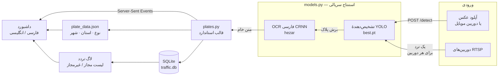

<div align="center">


# IranPlate Vision

**تشخیص پلاک خودروهای ایرانی با OCR فارسی، مانیتورینگ چند دوربین RTSP، و داشبورد دوزبانه.**

یک عکس یا استریم RTSP به آن بدهید تا شمارهٔ پلاک، نوع خودرو و استان صادرکننده را
برگرداند — سپس تردد هر خودرو را ثبت می‌کند و پلاک‌های لیست غیرمجاز را هشدار می‌دهد.

[](https://github.com/saeed205/IranPlate-Vision/actions/workflows/ci.yml)
[](https://www.python.org/)
[](https://flask.palletsprojects.com/)
[](https://docs.ultralytics.com/)
[](LICENSE)

**[English](README.md)** · [شروع سریع](#شروع-سریع) · [نحوهٔ کار](#نحوهٔ-کار) · [API](#api) · [تنظیمات](#تنظیمات)

</div>

---

<div dir="rtl">

## قابلیت‌ها

| | |
|---|---|
| 🔍 **تشخیص پلاک** | مدل YOLO برای یافتن پلاک و مدل CRNN فارسی برای خواندن آن، از عکس آپلودی یا دوربین موبایل |
| 🏷️ **رمزگشایی پلاک** | تفکیک اجزای پلاک، تعیین نوع خودرو از حرف آن (شخصی، تاکسی، دولتی، پلیس، ارتش و…) و تبدیل کد دو رقمی به استان و شهر |
| 📹 **چند دوربین RTSP** | یک ترد مستقل برای هر دوربین با اتصال مجدد خودکار، تایم‌اوت محدود، و پیش‌نمایش زنده |
| 🚦 **کنترل دسترسی** | لیست مجاز/غیرمجاز برای هر پلاک؛ پلاک غیرمجاز به‌محض دیده‌شدن هشدار می‌دهد |
| 📜 **لاگ تردد** | ثبت هر ورود و خروج همراه با دوربین، نقش، میزان اطمینان، زمان و تصویر برش‌خوردهٔ پلاک |
| ⚡ **بروزرسانی زنده** | ارسال تشخیص‌ها و وضعیت دوربین‌ها با Server-Sent Events، بدون polling |
| 🌐 **رابط دوزبانه** | فارسی و انگلیسی کامل، سازگار با RTL، قابل تغییر بدون رفرش صفحه |

## تصاویر

</div>

<div align="center">

| داشبورد | نتیجهٔ اسکن |
|---|---|
|  |  |

| مدیریت دوربین‌ها | صفحهٔ اسکن |
|---|---|
|  |  |

</div>

<div dir="rtl">

## شروع سریع

</div>

```bash
git clone https://github.com/saeed205/IranPlate-Vision.git
cd IranPlate-Vision
python -m venv .venv
.venv\Scripts\activate          # لینوکس/مک: . .venv/bin/activate
pip install -r requirements.txt
python app.py
```

<div dir="rtl">

آدرس <http://localhost:5000> را باز کنید.

در اولین اجرا مدل OCR فارسی (حدود ۵۰ مگابایت) دانلود می‌شود. تا پایان دانلود،
`/detect` کد `503` برمی‌گرداند و داشبورد وضعیت «در حال بارگذاری» را نشان می‌دهد.
اگر لازم دارید برنامه‌نویسی‌شده منتظر آماده‌شدن بمانید، `/health` را poll کنید.

### اجرا با Docker

</div>

```bash
docker compose up --build
```

<div dir="rtl">

ایمیج با waitress و کاربر غیر-root اجرا می‌شود. دیتابیس و کش مدل در volume جداگانه
نگه داشته می‌شوند، پس build مجدد باعث دانلود دوبارهٔ مدل نمی‌شود.

### اسکن با دوربین موبایل

مرورگرها دسترسی به دوربین را فقط در secure origin می‌دهند، پس HTTP ساده روی شبکهٔ
محلی کار نمی‌کند. این را اجرا کنید:

</div>

```bash
python run_https.py
```

<div dir="rtl">

یک گواهی self-signed می‌سازد که آدرس شبکهٔ محلی شما در SAN آن هست، و آدرسی را که
باید روی موبایل باز کنید چاپ می‌کند. هشدار مرورگر را با **Advanced → Proceed** رد کنید.

### اجرای production

دستور `python app.py` سرور توسعهٔ Flask است. برای استفادهٔ واقعی:

</div>

```bash
make serve    # waitress-serve --host=0.0.0.0 --port=5000 --threads=8 app:app
```

<div dir="rtl">

> [!WARNING]
> این برنامه **هیچ احراز هویتی ندارد.** هر کسی که به این پورت دسترسی داشته باشد
> می‌تواند دوربین‌ها را ببیند و لیست پلاک‌ها را تغییر دهد. آن را روی شبکهٔ مطمئن
> نگه دارید یا پشت یک reverse proxy با TLS و احراز هویت بگذارید.
> [SECURITY.md](SECURITY.md) را ببینید.

## نحوهٔ کار

</div>



<div dir="rtl">

هر دو مسیر ورودی از یک ماژول استنتاج مشترک استفاده می‌کنند و همهٔ فراخوانی‌های مدل
پشت یک قفل سریالی می‌شوند — ماژول‌های torch برای فراخوانی همزمان از چند ترد ساخته نشده‌اند.

### قالب پلاک

همه چیز به یک رشتهٔ استاندارد تبدیل می‌شود: **`24ن144-66`** — دو رقم، حرف، سه رقم،
خط تیره، و کد دو رقمی استان. ارقام فارسی و عربی پذیرفته می‌شوند، جداکننده اختیاری است،
و املاهای قابل تبدیل `ا`/`الف`، `ه`/`ھ`، `ي`/`ی`، `ك`/`ک` یکسان‌سازی می‌شوند.
مقایسهٔ خروجی خام OCR به‌جای این قالب استاندارد، همان چیزی بود که قبلاً لیست
مجاز/غیرمجاز را از کار انداخته بود.

| حرف | نوع خودرو | | حرف | نوع خودرو |
|:--:|---|---|:--:|---|
| `ب ج د س ص ط ق ل م ن و ه` | شخصی | | `الف` | دولتی |
| `ت` | تاکسی | | `پ` | پلیس |
| `ع` | حمل‌ونقل عمومی | | `ش` | ارتش |
| `ک` | کشاورزی | | `ث` | سپاه |
| `ژ` | جانبازان | | `ف ز` | نیروهای مسلح |
| `گ` | گذر موقت | | | |

## API

همهٔ پاسخ‌ها JSON هستند، از جمله خطاها: `{"error": "English | فارسی"}`.

| متد | مسیر | توضیح |
|---|---|---|
| `GET` | `/status` | `{ready, error, cameras, clients}` |
| `GET` | `/health` | بعد از بارگذاری مدل‌ها `200`، قبل از آن `503` |
| `POST` | `/detect` | فیلد multipart با نام `image`، حداکثر ۱۶ مگابایت |
| `GET` `POST` | `/api/cameras` | رمز RTSP در پاسخ‌ها ماسک می‌شود |
| `GET` `PUT` `DELETE` | `/api/cameras/<id>` | |
| `POST` | `/api/cameras/<id>/toggle` | بدنه: `{enabled}` |
| `GET` | `/api/cameras/<id>/snapshot` | `{image, age}` |
| `GET` | `/api/events` | استریم SSE: `detection` و `camera_status` |
| `GET` `DELETE` | `/api/log` | `?limit=` بین ۱ تا ۱۰۰۰ |
| `GET` | `/api/log/<id>/crop` | تصویر برش‌خوردهٔ ذخیره‌شده |
| `GET` `POST` | `/api/vehicles` | لیست مجاز/غیرمجاز |
| `DELETE` | `/api/vehicles/<plate>` | |

### نمونه

</div>

```bash
curl -s -F image=@car.jpg http://localhost:5000/detect | jq '{plate, best_conf, plate_info}'
```

```json
{
  "plate": "24ن144-66",
  "best_conf": 0.9328,
  "plate_info": {
    "prefix": "24", "letter": "ن", "middle": "144", "suffix": "66",
    "canonical": "24ن144-66",
    "vehicle_type": { "id": "shakhsi", "type": "خودروهای شخصی", "bg": "#f2ede0" },
    "locations": [{ "province": "تهران", "city": "تهران" }]
  }
}
```

<div dir="rtl">

## تنظیمات

همه اختیاری هستند؛ مقدار پیش‌فرض در ستون دوم.

| متغیر | پیش‌فرض | کاربرد |
|---|---|---|
| `PLATE_HOST` / `PLATE_PORT` | `0.0.0.0` / `5000` | آدرس bind |
| `PLATE_DB` | `./traffic.db` | مسیر SQLite |
| `PLATE_LOG_LEVEL` | `INFO` | سطح لاگ |
| `PLATE_MAX_UPLOAD_MB` | `16` | سقف حجم آپلود `/detect` |
| `PLATE_MAX_IMAGE_SIDE` | `1920` | عکس‌های بزرگ‌تر کوچک می‌شوند |
| `PLATE_DET_CONF` | `0.4` | آستانهٔ اطمینان تشخیص |
| `PLATE_WEIGHTS` | `./best.pt` | فایل وزن‌های مدل |
| `PLATE_OCR_MODEL` | `hezarai/crnn-fa-…-v2` | شناسهٔ مدل OCR |
| `PLATE_DETECT_INTERVAL` | `2.0` | فاصلهٔ ثانیه‌ای تشخیص روی RTSP |
| `PLATE_SNAPSHOT_FPS` | `4` | نرخ کدگذاری پیش‌نمایش زنده |
| `PLATE_OPEN_TIMEOUT_MS` | `6000` | تایم‌اوت اتصال RTSP |
| `PLATE_RECONNECT_WAIT` | `5.0` | ثانیه تا تلاش مجدد RTSP |
| `PLATE_LOG_MAX_ROWS` | `5000` | سقف رکوردهای لاگ (هر رکورد تصویر دارد) |
| `PLATE_ALLOW_LOCAL_SOURCES` | تنظیم‌نشده | اجازهٔ مسیر فایل محلی به‌عنوان منبع دوربین — فقط برای تست، [SECURITY.md](SECURITY.md) |

## توسعه

</div>

```bash
pip install -r requirements-dev.txt

make test     # ۶۹ بررسی آفلاین — بدون سرور و بدون مدل
make smoke    # همهٔ endpointها روی سرور در حال اجرا
ruff check .  # لینت
```

<div dir="rtl">

`make test` قالب پلاک، جست‌وجوی استان، API و منطق ثبت تشخیص در worker دوربین را
پوشش می‌دهد. چون مدل‌ها lazy بارگذاری می‌شوند، این تست‌ها بدون نصب ultralytics و
torch در چند ثانیه اجرا می‌شوند.

### ساختار پروژه

</div>

```text
app.py                 مسیرهای Flask، ایندکس plate_data، مدیریت خطای JSON
models.py              بارگذاری lazy مدل‌ها، استنتاج سریالی
plates.py              پارس و استانداردسازی پلاک
camera_manager.py      تردهای RTSP، بس رویداد SSE
db.py                  اسکیمای SQLite، کوئری‌ها، migration
run_https.py           گواهی TLS برای دسترسی دوربین موبایل
plate_data.json        جداول استان، شهر و نوع خودرو
best.pt                وزن‌های مدل تشخیص YOLO
templates/             menu.html · index.html (اسکن) · cameras.html
static/i18n.js         تغییر زبان در زمان اجرا
scripts/               تست‌ها و ابزار بررسی RTSP
```

<div dir="rtl">

## مشارکت

Issue و Pull Request پذیرفته می‌شود — [CONTRIBUTING.md](CONTRIBUTING.md) و
[منشور رفتاری](CODE_OF_CONDUCT.md) را ببینید. موضوعات مناسب برای شروع: پشتیبانی از
قالب‌های دیگر پلاک (موتورسیکلت، سیاسی)، بهبود دقت OCR روی تصاویر شبانه، و احراز هویت.

لطفاً هرگز رمز واقعی RTSP یا تصویر افراد قابل شناسایی را در issue قرار ندهید.

## قدردانی

- تشخیص پلاک بر پایهٔ [Ultralytics YOLO](https://docs.ultralytics.com/)
- OCR فارسی از [hezarai/crnn-fa-license-plate-recognition-v2](https://huggingface.co/hezarai/crnn-fa-license-plate-recognition-v2)
- این مخزن به‌عنوان fork از [12345zahraa/Persian-Plates-Detection](https://github.com/12345zahraa/Persian-Plates-Detection) نگهداری می‌شود

## مجوز

[MIT](LICENSE). وزن‌های مدل و فونت‌های همراه، مجوز خودشان را دارند.

</div>

<div align="center">
<sub>اگر این پروژه برایتان مفید بود، یک ⭐ به دیده‌شدنش کمک می‌کند.</sub>
</div>
