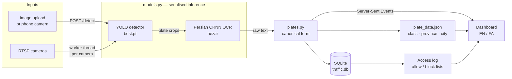

<div align="center">


# IranPlate Vision

**Iranian license plate detection with Persian OCR, multi-camera RTSP monitoring, and a bilingual dashboard.**

Point it at an image or an RTSP stream and it returns the plate, the vehicle
class, and the issuing province — then logs every passing vehicle and flags the
ones on your block list.

[](https://github.com/saeed205/IranPlate-Vision/actions/workflows/ci.yml)
[](https://www.python.org/)
[](https://flask.palletsprojects.com/)
[](https://docs.ultralytics.com/)
[](LICENSE)
[](CONTRIBUTING.md)

**[فارسی](README.fa.md)** · [Quick start](#quick-start) · [How it works](#how-it-works) · [API](#api) · [Configuration](#configuration)

</div>

---

## What it does

| | |
|---|---|
| 🔍 **Plate detection** | YOLO detector plus a Persian CRNN OCR model, from an uploaded image or a phone camera |
| 🏷️ **Plate decoding** | Splits the plate, identifies the vehicle class from its letter (private, taxi, government, police, army…), and resolves the two-digit suffix to a province and city |
| 📹 **Multi-camera RTSP** | One worker thread per camera with automatic reconnect, bounded connect timeouts, and a live preview |
| 🚦 **Access control** | Allow/block lists per plate; blocked plates raise an alert the moment they are seen |
| 📜 **Access log** | Every entry and exit recorded with camera, role, confidence, timestamp, and the cropped plate image |
| ⚡ **Live updates** | Server-Sent Events push detections and camera health to the dashboard with no polling |
| 🌐 **Bilingual UI** | Full English and Persian, RTL-aware, switchable at runtime with no reload |

## Screenshots

<div align="center">

| Dashboard | Scan result |
|---|---|
|  |  |

| Camera management | Persian (RTL) |
|---|---|
|  |  |

</div>

## Quick start

```bash
git clone https://github.com/saeed205/IranPlate-Vision.git
cd IranPlate-Vision
python -m venv .venv && . .venv/bin/activate     # Windows: .venv\Scripts\activate
pip install -r requirements.txt
python app.py
```

Open <http://localhost:5000>.

The first start downloads the Persian OCR model (~50 MB). Until it finishes,
`/detect` answers `503` and the dashboard shows a loading indicator — poll
`/health` if you need to wait for readiness programmatically.

<details>
<summary><b>Docker</b></summary>

```bash
docker compose up --build
```

The image serves through waitress as a non-root user. The database and the model
cache live in named volumes, so a rebuild does not re-download the model.

</details>

<details>
<summary><b>Scanning from a phone</b></summary>

Browsers only expose the camera on a secure origin, so plain HTTP over your LAN
will not work. Run:

```bash
python run_https.py
```

It generates a self-signed certificate that includes your LAN address in its
SAN, then prints the URL to open on the phone. Accept the browser warning via
**Advanced → Proceed**.

</details>

<details>
<summary><b>Production</b></summary>

`python app.py` is Flask's development server. For anything shared, use:

```bash
make serve    # waitress-serve --host=0.0.0.0 --port=5000 --threads=8 app:app
```

> [!WARNING]
> There is **no authentication**. Anyone who can reach the port can view your
> cameras and edit your plate lists. Keep it on a trusted network, or put it
> behind a reverse proxy that handles TLS and auth. See [SECURITY.md](SECURITY.md).

</details>

## How it works



Both entry points share one inference module, and every model call is serialised
behind a lock — torch modules are not safe to call from several threads at once.

**Plate format.** Everything is normalised to one canonical string,
`24ن144-66`: two digits, the letter, three digits, a dash, and the two-digit
province code. Persian and Arabic-Indic digits are accepted, separators are
optional, and the interchangeable letter spellings `ا`/`الف`, `ه`/`ھ`, `ي`/`ی`,
`ك`/`ک` are folded together. Comparing raw OCR output instead of the canonical
form is what previously broke the allow/block list.

<div align="center">

| Letter | Vehicle class | | Letter | Vehicle class |
|:--:|---|---|:--:|---|
| `ب ج د س ص ط ق ل م ن و ه` | Private | | `الف` | Government |
| `ت` | Taxi | | `پ` | Police |
| `ع` | Public transport | | `ش` | Army |
| `ک` | Agricultural | | `ث` | IRGC |
| `ژ` | Disabled veterans | | `ف ز` | Armed forces |
| `گ` | Temporary transit | | | |

</div>

## API

Every response is JSON, including errors: `{"error": "English | فارسی"}`.

| Method | Path | Notes |
|---|---|---|
| `GET` | `/status` | `{ready, error, cameras, clients}` |
| `GET` | `/health` | `200` once models are loaded, `503` before |
| `POST` | `/detect` | multipart `image`; max 16 MB |
| `GET` `POST` | `/api/cameras` | RTSP passwords are masked in responses |
| `GET` `PUT` `DELETE` | `/api/cameras/<id>` | |
| `POST` | `/api/cameras/<id>/toggle` | body `{enabled}` |
| `GET` | `/api/cameras/<id>/snapshot` | `{image, age}` |
| `GET` | `/api/events` | SSE stream: `detection`, `camera_status` |
| `GET` `DELETE` | `/api/log` | `?limit=` 1–1000 |
| `GET` | `/api/log/<id>/crop` | the stored plate crop |
| `GET` `POST` | `/api/vehicles` | allow/block lists |
| `DELETE` | `/api/vehicles/<plate>` | |

<details>
<summary><b>Example: detect a plate</b></summary>

```bash
curl -s -F image=@car.jpg http://localhost:5000/detect | jq '{plate, best_conf, plate_info}'
```

```json
{
  "plate": "24ن144-66",
  "best_conf": 0.9328,
  "plate_info": {
    "prefix": "24", "letter": "ن", "middle": "144", "suffix": "66",
    "canonical": "24ن144-66",
    "vehicle_type": { "id": "shakhsi", "type": "خودروهای شخصی", "bg": "#f2ede0" },
    "locations": [{ "province": "تهران", "city": "تهران" }]
  }
}
```

</details>

## Configuration

All optional; defaults in parentheses.

| Variable | Default | Purpose |
|---|---|---|
| `PLATE_HOST` / `PLATE_PORT` | `0.0.0.0` / `5000` | Bind address |
| `PLATE_DB` | `./traffic.db` | SQLite path |
| `PLATE_LOG_LEVEL` | `INFO` | Logging level |
| `PLATE_MAX_UPLOAD_MB` | `16` | Upload cap for `/detect` |
| `PLATE_MAX_IMAGE_SIDE` | `1920` | Uploads are downscaled to this |
| `PLATE_DET_CONF` | `0.4` | Detector confidence threshold |
| `PLATE_WEIGHTS` | `./best.pt` | Detector weights |
| `PLATE_OCR_MODEL` | `hezarai/crnn-fa-…-v2` | OCR model id |
| `PLATE_DETECT_INTERVAL` | `2.0` | Seconds between RTSP detections |
| `PLATE_SNAPSHOT_FPS` | `4` | Live-preview encode rate |
| `PLATE_OPEN_TIMEOUT_MS` | `6000` | RTSP connect timeout |
| `PLATE_RECONNECT_WAIT` | `5.0` | Seconds before an RTSP retry |
| `PLATE_LOG_MAX_ROWS` | `5000` | Access-log cap (rows store JPEG crops) |
| `PLATE_ALLOW_LOCAL_SOURCES` | unset | Allow file paths as camera sources — testing only, see [SECURITY.md](SECURITY.md) |

## Development

```bash
pip install -r requirements-dev.txt

make test     # 69 offline checks — no server, no models needed
make smoke    # every endpoint against a running server
ruff check .  # lint
```

`make test` covers plate normalisation, the province lookup, the JSON API, and
the RTSP worker's detection bookkeeping. Because the models load lazily, it runs
in seconds without ultralytics or torch installed.

<details>
<summary><b>Project layout</b></summary>

```text
app.py                 Flask routes, plate_data indexes, JSON error handling
models.py              Lazy model loading, serialised inference
plates.py              Canonical plate parsing and normalisation
camera_manager.py      RTSP worker threads, SSE event bus
db.py                  SQLite schema, queries, migrations
run_https.py           Self-signed TLS for phone camera access
plate_data.json        Province, city and vehicle-class tables
best.pt                YOLO detector weights
templates/             menu.html · index.html (scan) · cameras.html
static/i18n.js         Runtime EN/FA switching
scripts/               Test suites and RTSP probes
```

</details>

## Contributing

Issues and pull requests are welcome — see [CONTRIBUTING.md](CONTRIBUTING.md)
and the [Code of Conduct](CODE_OF_CONDUCT.md). Good first areas: additional
plate formats (motorcycle, diplomatic), OCR accuracy on night footage, and
authentication.

Please never attach real RTSP credentials or footage of identifiable people to an
issue.

## Acknowledgements

- Plate detection built on [Ultralytics YOLO](https://docs.ultralytics.com/)
- Persian OCR by [hezarai/crnn-fa-license-plate-recognition-v2](https://huggingface.co/hezarai/crnn-fa-license-plate-recognition-v2)
- Maintained as a fork of [12345zahraa/Persian-Plates-Detection](https://github.com/12345zahraa/Persian-Plates-Detection)

## License

[MIT](LICENSE). The bundled model weights and fonts keep their own licenses.

<div align="center">
<sub>If this project is useful to you, a ⭐ helps others find it.</sub>
</div>
